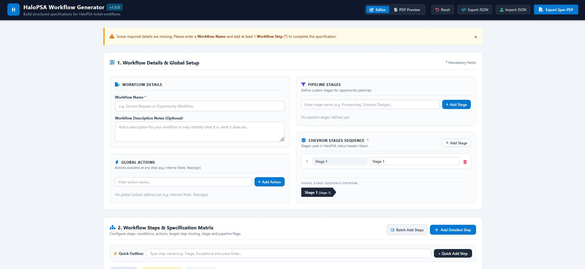

# HaloPSA Workflow Generator

A single-page web application designed to help MSPs, IT admins, and HaloPSA engineers build, structure, and document ticket workflows and pipeline specifications.

The main concept around this tool was to allow non-technical stakeholders to build a workflow specification easily without need for HaloPSA knowledge specifically, they can then provide the specification to a HaloPSA engineer in their company or external HaloPSA partner to give them clear requirements to build within the platform.

  

---

**What is this?**

The **HaloPSA Workflow Generator** is a web-based specification editor that allows you to draft and visualize structured HaloPSA ticket workflows before configuring them in the live system. Built using HTML, JavaScript, Tailwind CSS, FontAwesome, and jsPDF, it provides an interface to define ticket lifecycle stages, logic conditions, action buttons, and target step routing.

Note: I am not a developer, YES I used AI to help me with a lot of the coding and NO I am not ashamed to say so haha :)

---

**What does it do?**

* **Global Setup Management:** Configure overall workflow details, system-wide global actions (e.g., Internal Notes, Reassignments), and custom opportunity pipeline stages.
* **Visual Chevron Ribbon Preview:** Customize and preview stage progression ribbons dynamically as they appear in the HaloPSA status header.
* **Step Logic & Specification Matrix:** Design ticket steps using two logic modes:
  * **Action Steps:** Model manual user buttons, options, and data capture specifications.
  * **Condition Steps:** Define automated system evaluations with branching logic (Yes/No met/unmet targets).
* **Step Flag Roles:** Designate specific entry (`Start Step`) and resolution (`End Step`) points across the workflow.
* **Fast Creation Tools:** Build step outlines using single-line quick entries or multi-line batch inputs.
* **Multi-Page Spec PDF Generation:** Generate and download formatted PDF spec documents using client-side canvas rendering.
* **JSON State Management:** Export workflow specifications to `.json` files for offline backups, sharing, or later importing.

---

**How do I use it?**

1. **Open the App:** Save the file as an `.html` file (e.g., `index.html`) and open it in your browser.

2. **Define Workflow Basics:**
* Enter a **Workflow Name** and optional notes in Section 1.

* Add **Global Actions** and custom **Pipeline Stages** (if applicable).

* Define your **Chevron Stages Sequence** to set up the visual header ribbon.

3. **Build Workflow Steps:**
* Use **Quick Outline** or **Batch Add Steps** to create step titles.

* Click the **Edit** icon on any step to open the configuration modal.

* Select the step type (**Action** or **Condition**), assign the stage, set step flags, and define target step progression routing.

4. **Preview & Export:**
* Switch to the **PDF Preview** tab to review the generated multi-page documentation layout.

* Click **Export Spec PDF** to save a printable spec PDF document, or use **Export JSON** to save the raw file for future editing.

---

**Limitations**

This tool has been tested in Chrome & Firefox only - may not work in all browsers.

Although it is built for HaloPSA specifically, it does not cover everything that can be done within a workflow in HaloPSA itself - however the idea is to cover the core requirements which can then be built on.
